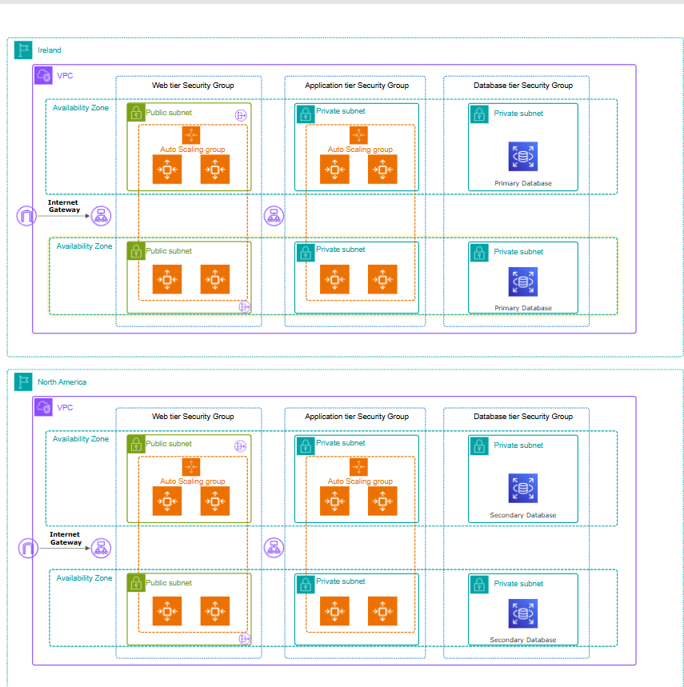

## Project Scenario: Hosting for MediAdvice

**MediAdvice** is a healthcare client planning to migrate their application to AWS. Their key requirements include:

* High availability across multiple Availability Zones (AZs) *and* multiple regions
* Fault tolerance and resilience
* Ability to automatically scale during traffic spikes
* Secure, maintainable cloud infrastructure

⚠️ This project was developed as a proof-of-concept for a Cloud Services assignment at CCT College Dublin.

The proposed AWS infrastructure design addresses these needs using core AWS services such as EC2, VPC, Internet Gateways, Security Groups, and Auto Scaling. While full cross-region disaster recovery is a future objective, this architecture establishes a resilient multi-region, multi-AZ foundation with segregated public and private subnets for secure, scalable hosting.

---

## Architecture Diagram: MediAdvice Multi-Region Design

The diagram below illustrates the AWS cloud architecture deployed across two regions: **Ireland (eu-west-1)** and **North America (us-east-1)**. Key design elements include:

* **Multi-Region Deployment** for enhanced fault tolerance and disaster readiness
* **VPCs in each region**, segmented into public and private subnets with distinct Security Groups
* **Internet Gateways** enabling internet access to public subnets
* **EC2 Instances** deployed across multiple AZs in each region to ensure high availability

---

## Technologies Used

* **Amazon EC2** – Linux instances hosting the web application
* **Amazon VPC** – Network isolation with public and private subnets
* **Internet Gateway** – Internet access for public subnets
* **Security Groups & IAM Roles** – Secure, least privilege access control
* **Auto Scaling Groups (ASG)** – Dynamic scaling based on demand

---

## Conclusion

This proof-of-concept project demonstrates how MediAdvice can leverage AWS to build a secure, scalable, and highly available cloud environment. The multi-region, multi-AZ architecture improves fault tolerance and resilience, while segregated networking and automated scaling address security and performance needs. This foundation prepares MediAdvice for future expansion and disaster recovery capabilities.